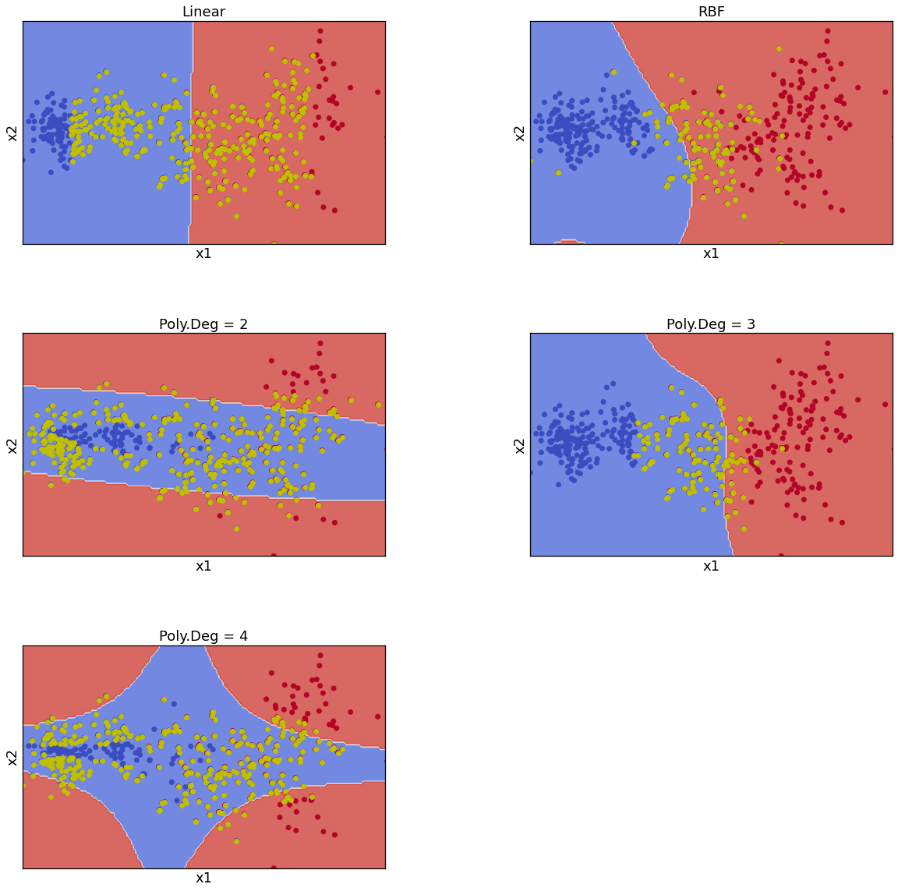
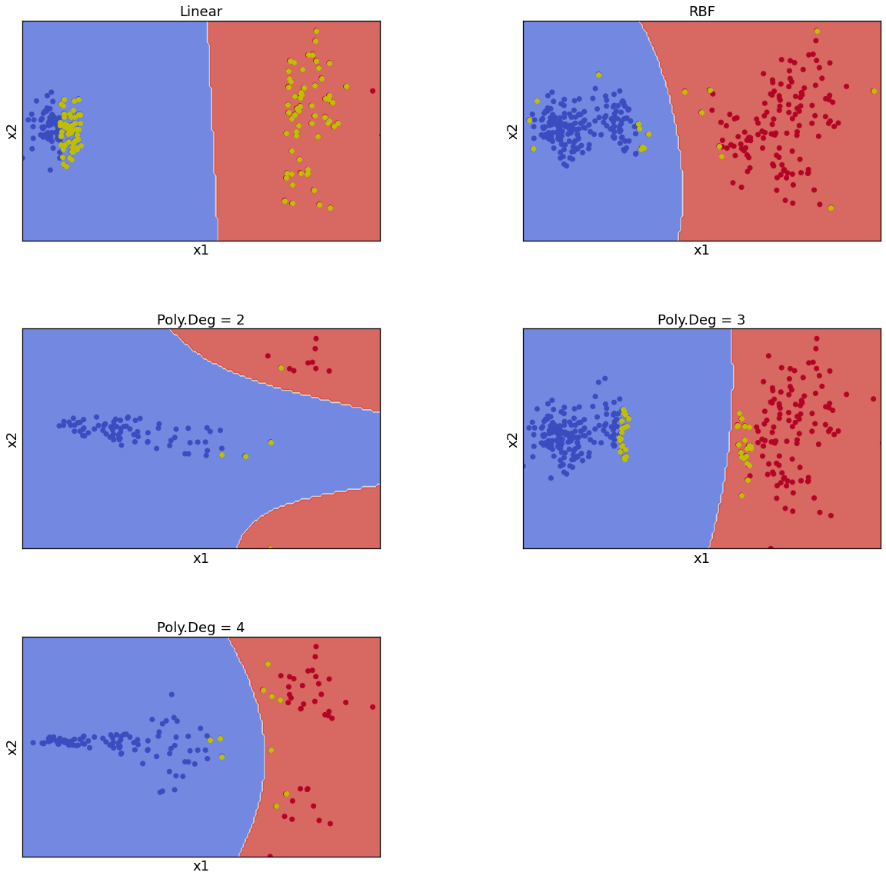

# ML-Assignment2
Solutions for Assignment 2 of the course ELL409 : Machine Intelligence and Learning taught by [**Prof. Prathosh A.P.**](https://sites.google.com/view/prathosh)

Find the Final Report here: [**Complete Report**](https://github.com/HarmanDotpy/ML-Assignment2/blob/main/Problem_Statement_and_Final_Report/Assignment2_Report_HarmanSingh_AayushSrivastava.pdf)

Find the Problem statements here: [**Problem Statements**](https://github.com/HarmanDotpy/ML-Assignment2/blob/main/Problem_Statement_and_Final_Report/ProblemStatement_Assignment_2_409_2020.pdf)

## Glimpses from the assignment 
### Fitting SVM's
(Old Data = Original Data with Support Vectors Marked in Yellow
 New Data = Support vectors removed from original data and SVM refitted, new support vectors marked in Yellow)

Old Data            |  New Data
:-------------------------:|:-------------------------:
  |  

### MNIST Visualization

PCA          |  tSNE
:-------------------------:|:-------------------------:
  |  

